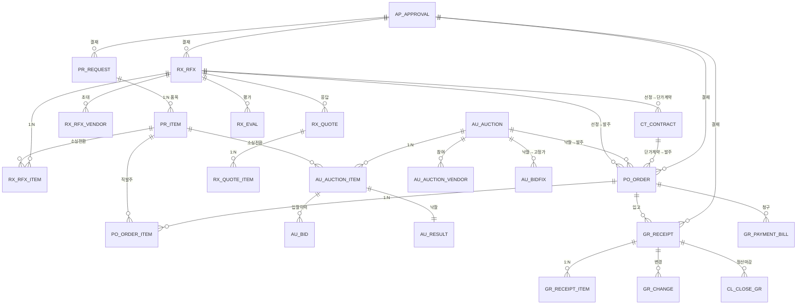

# DB 설계 (Part 2) — 구매 트랜잭션: PR · RX(견적/RFI) · AU(역경매/입찰고정가) · PO · GR

> 확정 표준(Part1) 적용: 대리키 `ID`(IDENTITY) + 업무UK / 다법인 `COMP_CD` / 논리삭제 `DEL_YN` / 일자 `DATE`(SAP연계분 문자8 병행)
> 공통컬럼(모든 테이블 공통, 본문 생략): `ID, COMP_CD, USE_YN, DEL_YN, STS, REG_ID, REG_DT, MOD_ID, MOD_DT`
> 표기: 🔑PK · ⭐UK(업무유니크) · 🔗FK

---

## 1. PR_ 구매요청

### PR_REQUEST (구매요청 헤더)
| 컬럼 | 타입 | 설명 |
|------|------|------|
| ID 🔑 | NUMBER | 대리키 |
| PR_NO ⭐ | VARCHAR2(30) | 구매요청번호 (CM_DOC_NO 채번, UK: COMP_CD+PR_NO) |
| PR_TITLE | VARCHAR2(300) | 요청 제목 |
| PR_TYP | VARCHAR2(18) | 요청유형 (PRODUCT 물품 / SERVICE 용역) |
| PURC_GRP_CD 🔗 | VARCHAR2(18) | 구매그룹 → CM_PURC_GRP |
| REQ_DEPT_CD 🔗 | VARCHAR2(18) | 요청부서 → CM_DEPT |
| REQ_USR_ID 🔗 | VARCHAR2(18) | 요청자 → CM_USER |
| OPER_ORG_CD 🔗 | VARCHAR2(18) | 운영조직(플랜트) → CM_OPER_ORG |
| REQ_YMD | DATE | 요청일 |
| HOPE_DLV_YMD | DATE | 희망납기일 |
| CURR_CD | VARCHAR2(3) | 통화 |
| TOT_AMT | NUMBER(20,5) | 요청 합계금액 |
| SRC_TYP | VARCHAR2(18) | 후속 소싱유형 (RFX/AUCTION/CONTRACT/DIRECT) |
| STS | VARCHAR2(18) | 진행상태(↓) |
| APRV_ID 🔗 | NUMBER | 결재 → AP_APPROVAL |
| REMARK | VARCHAR2(2000) | 비고 |

**STS 진행상태**: `TMP`작성중 → `REQ`상신 → `APRV_ING`결재중 → `APRV_END`결재완료 → `SRC_ING`소싱중 → `VD_SEL`협력사선정 → `CT_WAIT`계약예정 → `CT_END`계약완료 / `RTN`반려 · `CANCEL`취소

### PR_ITEM (구매요청 품목)
| 컬럼 | 타입 | 설명 |
|------|------|------|
| ID 🔑 | NUMBER | 대리키 |
| REQUEST_ID 🔗 | NUMBER | → PR_REQUEST.ID |
| LINE_NO ⭐ | NUMBER | 품목 순번 (UK: REQUEST_ID+LINE_NO) |
| ITEM_CD 🔗 | VARCHAR2(18) | 품목 → IT_ITEM (신규품목요청 시 NULL+NEW_ITEM_YN) |
| NEW_ITEM_YN | CHAR(1) | 신규품목 동시요청 여부 |
| ITEM_NM | VARCHAR2(300) | 품목명(미등록품목 직접입력) |
| SPEC | VARCHAR2(500) | 규격 |
| UNIT_CD | VARCHAR2(18) | 단위 |
| QTY | NUMBER(20,5) | 요청수량 |
| EST_PRC | NUMBER(20,5) | 예상단가 |
| AMT | NUMBER(20,5) | 금액 |
| HOPE_DLV_YMD | DATE | 품목별 희망납기 |
| DLV_PLACE | VARCHAR2(300) | 납품장소 |
| REMARK | VARCHAR2(1000) | 비고 |

### PR_ATTACH (요청 첨부) — `ATTACH_GRP_ID` → CM_ATTACH 참조

---

## 2. RX_ 견적(RFx) / 정보요청(RFI)

### RX_RFX (견적 헤더)
| 컬럼 | 타입 | 설명 |
|------|------|------|
| ID 🔑 | NUMBER | 대리키 |
| RFX_NO ⭐ | VARCHAR2(30) | 견적번호 (UK: COMP_CD+RFX_NO) |
| RFX_TYP | VARCHAR2(18) | RFQ(견적)/RFP(제안)/SAL(판매) |
| RFX_TITLE | VARCHAR2(300) | 제목 |
| PURC_GRP_CD 🔗 | VARCHAR2(18) | 구매그룹 |
| CHRG_USR_ID 🔗 | VARCHAR2(18) | 담당자 |
| OPEN_DT | TIMESTAMP | 공고시작일시 |
| CLOSE_DT | TIMESTAMP | 마감일시 |
| EVAL_TYP | VARCHAR2(18) | 평가방식 (PRICE 최저가 / SCORE 종합점수) |
| CURR_CD | VARCHAR2(3) | 통화 |
| PRICE_GRP_CD 🔗 | VARCHAR2(18) | 가격군 → PF_PRICE_GRP |
| STS | VARCHAR2(18) | 진행상태(↓) |
| APRV_ID 🔗 | NUMBER | 결재 |
| REMARK | VARCHAR2(2000) | 비고 |

**STS**: `TMP`작성 → `OPEN`공고중 → `ING`진행중(응찰) → `EVAL`평가중 → `EVAL_END`평가종료 → `SEL`선정 / `FAIL`유찰 → `END`종료 / `RE`재견적 · `CANCEL`취소

### RX_RFX_ITEM (견적 품목)
- `RFX_ID`🔗, `LINE_NO`⭐, `PR_ITEM_ID`🔗(원 구매요청 품목), `ITEM_CD`, `ITEM_NM`, `SPEC`, `UNIT_CD`, `QTY`, `BASE_PRC`(기준가), `DLV_YMD`

### RX_RFX_VENDOR (초대 협력사)
- `RFX_ID`🔗, `VD_CD`🔗⭐, `INVITE_DT`, `RESP_YN`(응찰여부), `SEL_YN`(선정여부)

### RX_QUOTE (협력사 견적 응답 헤더)
- `RFX_ID`🔗, `VD_CD`🔗⭐, `QUOTE_DT`(제출일시), `TOT_AMT`, `VALID_YMD`(견적유효일), `ATTACH_GRP_ID`, `STS`(임시/제출)

### RX_QUOTE_ITEM (협력사 견적 품목)
- `QUOTE_ID`🔗, `RFX_ITEM_ID`🔗⭐, `OFFER_PRC`(제시단가), `OFFER_AMT`, `DLV_YMD`(납기), `REMARK`

### RX_EVAL (견적 평가 헤더) / RX_EVAL_SCORE (평가 점수)
- RX_EVAL: `RFX_ID`🔗, `EVAL_USR_ID`(평가위원), `EVAL_DT`
- RX_EVAL_SCORE: `EVAL_ID`🔗, `VD_CD`🔗, `EVAL_ITEM_CD`(평가항목), `SCORE`, `WEIGHT`(가중치), `WEIGHTED_SCORE`

### RX_RFI / RX_RFI_ITEM / RX_RFI_ANS (정보요청)
- RX_RFI: `RFI_NO`⭐, `TITLE`, `SEND_DT`, `CLOSE_DT`, `CHRG_USR_ID`, `STS`(작성/발송/마감)
- RX_RFI_ITEM: `RFI_ID`🔗, `LINE_NO`⭐, `QUESTION`, `ANS_TYP`(주관/객관)
- RX_RFI_ANS: `RFI_ITEM_ID`🔗, `VD_CD`🔗, `ANSWER`, `ANS_DT`

---

## 3. AU_ 역경매 / 입찰고정가

### AU_AUCTION (역경매 헤더)
| 컬럼 | 타입 | 설명 |
|------|------|------|
| ID 🔑 | NUMBER | 대리키 |
| AUCTION_NO ⭐ | VARCHAR2(30) | 역경매번호 |
| AUCTION_TITLE | VARCHAR2(300) | 제목 |
| PURC_GRP_CD 🔗 | VARCHAR2(18) | 구매그룹 |
| CHRG_USR_ID 🔗 | VARCHAR2(18) | 담당자 |
| START_DT | TIMESTAMP | 시작일시 |
| END_DT | TIMESTAMP | 종료일시 |
| EXT_MIN | NUMBER | 자동연장(분) |
| START_PRC | NUMBER(20,5) | 시작가(상한) |
| MIN_DOWN_PRC | NUMBER(20,5) | 최소 하향폭 |
| CURR_CD | VARCHAR2(3) | 통화 |
| STS | VARCHAR2(18) | 진행상태(↓) |
| APRV_ID 🔗 | NUMBER | 결재 |

**STS**: `TMP`작성 → `OPEN`공고 → `ING`진행중(입찰) → `END`종료 → `AWARD`낙찰 / `FAIL`유찰 · `CANCEL`취소

### AU_AUCTION_ITEM (역경매 품목) — `AUCTION_ID`🔗, `LINE_NO`⭐, `PR_ITEM_ID`🔗, `ITEM_CD`, `QTY`, `START_PRC`
### AU_AUCTION_VENDOR (참여 협력사) — `AUCTION_ID`🔗, `VD_CD`🔗⭐, `JOIN_YN`, `AWARD_YN`(낙찰)
### AU_BID (입찰 내역) — `AUCTION_ID`🔗, `AUCTION_ITEM_ID`🔗, `VD_CD`🔗, `BID_PRC`, `BID_DT`, `RANK`(순위) — *입찰마다 1행 적재(이력성)*
### AU_RESULT (낙찰 결과) — `AUCTION_ITEM_ID`🔗⭐, `VD_CD`🔗, `AWARD_PRC`, `AWARD_AMT`

### AU_BIDFIX / AU_BIDFIX_RSV (입찰고정가/변경예약)
- AU_BIDFIX: `ITEM_CD`🔗, `VD_CD`🔗, `OPER_ORG_CD`, `FIX_PRC`, `APPLY_SD`, `APPLY_ED`, `SRC_AUCTION_ID`🔗(원 역경매)
- AU_BIDFIX_RSV: `BNDL_ID`(번들), `BIDFIX_ID`🔗, `NEW_PRC`, `NEW_APPLY_SD`, `RSV_STS`(예약/완료/실패), `APRV_ID`, `IF_STATUS`(SAP)

---

## 4. PO_ 발주

### PO_ORDER (발주 헤더)
| 컬럼 | 타입 | 설명 |
|------|------|------|
| ID 🔑 | NUMBER | 대리키 |
| PO_NO ⭐ | VARCHAR2(30) | 발주번호 (UK: COMP_CD+PO_NO) |
| PO_REV | NUMBER DEFAULT 0 | 발주 수정판수 |
| PO_TITLE | VARCHAR2(300) | 제목 |
| VD_CD 🔗 | VARCHAR2(18) | 협력사 → VD_VENDOR |
| PURC_GRP_CD 🔗 | VARCHAR2(18) | 구매그룹 |
| CHRG_USR_ID 🔗 | VARCHAR2(18) | 담당자 |
| OPER_ORG_CD 🔗 | VARCHAR2(18) | 운영조직(플랜트) |
| SRC_TYP | VARCHAR2(18) | 생성원천 (PR/RFX/AUCTION/CONTRACT) |
| SRC_ID | NUMBER | 원천 문서 ID |
| PO_YMD | DATE | 발주일 |
| DLV_YMD | DATE | 납기일 |
| DLV_COND | VARCHAR2(100) | 납품조건 |
| PAY_COND | VARCHAR2(100) | 결제조건 |
| CURR_CD | VARCHAR2(3) | 통화 |
| SUPL_AMT | NUMBER(20,5) | 공급가액 |
| VAT_AMT | NUMBER(20,5) | 부가세 |
| TOT_AMT | NUMBER(20,5) | 합계 |
| STS | VARCHAR2(18) | 진행상태(↓) |
| APRV_ID 🔗 | NUMBER | 결재 |
| IF_STATUS | CHAR(1) | SAP 전송상태 |

**STS**: `TMP`작성 → `APRV_ING`결재중 → `PC`발주완료 → `GR_REQ`입고요청 → `GR_ING`검수진행 → `GR_END`검수완료 / `GR_CANCEL`취소 · `CHG`변경

### PO_ORDER_ITEM (발주 품목)
- `ORDER_ID`🔗, `LINE_NO`⭐, `PR_ITEM_ID`🔗, `CONTRACT_ITEM_ID`🔗(단가계약 출처), `ITEM_CD`🔗, `ITEM_NM`, `SPEC`, `UNIT_CD`, `QTY`, `PRC`(단가), `SUPL_AMT`, `VAT_AMT`, `AMT`, `DLV_YMD`, `GR_QTY`(입고누계), `STS`

### PO_ORDER_HIS (발주 수정판수 이력) — 판수별 헤더/품목 스냅샷(JSON 또는 정규화), `ORDER_ID`🔗, `PO_REV`, `CHG_RSN`

---

## 5. GR_ 입고/검수

### GR_RECEIPT (입고/검수 헤더)
| 컬럼 | 타입 | 설명 |
|------|------|------|
| ID 🔑 | NUMBER | 대리키 |
| GR_NO ⭐ | VARCHAR2(30) | 입고번호 |
| PO_ID 🔗 | NUMBER | → PO_ORDER.ID |
| VD_CD 🔗 | VARCHAR2(18) | 협력사 |
| OPER_ORG_CD 🔗 | VARCHAR2(18) | 입고 운영조직(플랜트) |
| GR_YMD | DATE | 입고일 |
| INSP_USR_ID 🔗 | VARCHAR2(18) | 검수자 |
| INSP_YMD | DATE | 검수일 |
| TOT_AMT | NUMBER(20,5) | 입고금액 |
| STS | VARCHAR2(18) | 진행상태(↓) |
| APRV_ID 🔗 | NUMBER | 결재 |
| IF_STATUS | CHAR(1) | SAP 전송상태 |

**STS**: `TMP`작성 → `INSP_ING`검수중 → `INSP_END`검수완료 → `APRV_END`결재완료 → `CLOSE`마감 / `CANCEL`취소

### GR_RECEIPT_ITEM (입고 품목)
- `RECEIPT_ID`🔗, `LINE_NO`⭐, `PO_ITEM_ID`🔗, `ITEM_CD`🔗, `PO_QTY`(발주수량), `GR_QTY`(입고수량), `INSP_PASS_QTY`(합격), `INSP_FAIL_QTY`(불합격), `PRC`, `AMT`, `INSP_RESULT`(합격/불합격/부분)

### GR_CHANGE (입고변경 GrChg)
- `GR_ID`🔗, `CHG_TYP`, `BEFORE_QTY/AFTER_QTY`, `CHG_RSN`, `APRV_ID`🔗, `RSV_STS`(예약/완료)

### GR_PAYMENT_BILL (선급금/기성 청구)
- `BILL_NO`⭐, `PO_ID`🔗, `VD_CD`🔗, `BILL_TYP`(선급/기성), `BILL_AMT`, `BILL_YMD`, `APRV_ID`🔗, `STS`

### GR_GRT (보증보험료)
- `GR_ID`🔗, `GRT_TYP`(계약이행/선급금/하자), `GRT_AMT`, `GRT_RATE`, `INSURE_CO`, `INSURE_NO`, `INSURE_SD/ED`

---

## 6. ERD 관계 (구매 트랜잭션 흐름)

**핵심 흐름**: PR_ITEM → (RX 또는 AU 또는 CT) → PO_ORDER_ITEM → GR_RECEIPT_ITEM → CL(정산). 모든 헤더 문서는 AP_APPROVAL(결재)과 1:N 연결.

---

## 다음 (Part 3)
- CT(단가계약) · IP(품목단가) · TP(인도가) · CL(정산/마감) · PF(가격요소/시황/실적/판매/채권) 컬럼 상세
- 단가 구간(APPLY_SD/ED) 관리 모델, 갭정산(매입/분배/금액/매출) 구조
