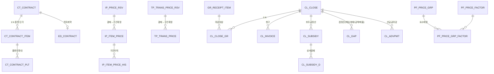

# DB 설계 (Part 3) — CT(계약) · IP(품목단가) · TP(인도가) · CL(정산/마감) · PF(가격요소·시황·실적·판매·채권)

> 표준(Part1) 적용. 공통컬럼 생략. 표기 🔑PK · ⭐UK · 🔗FK
> 본 파트의 난점: **단가 구간관리(APPLY_SD/ED)** 와 **갭정산(매입/분배/금액/매출)**. 원본 프로시저(SP_COMPOSE_ITEMPRICE, SP_COMPOSE_TRANSPRICE, SP_GR_GRT_*) 로직을 데이터모델로 정리.

---

## 1. CT_ 단가계약

### CT_CONTRACT (계약 헤더)
| 컬럼 | 타입 | 설명 |
|------|------|------|
| ID 🔑 | NUMBER | 대리키 |
| CT_NO ⭐ | VARCHAR2(30) | 계약번호 (UK: COMP_CD+CT_NO) |
| CT_REV | NUMBER DEFAULT 0 | 계약 수정판수 |
| CT_TITLE | VARCHAR2(300) | 계약명 |
| CT_TYP | VARCHAR2(18) | 계약유형(단가계약/일반계약) |
| VD_CD 🔗 | VARCHAR2(18) | 협력사 |
| PURC_GRP_CD 🔗 | VARCHAR2(18) | 구매그룹 |
| CHRG_USR_ID 🔗 | VARCHAR2(18) | 담당자 |
| VALID_SD / VALID_ED | DATE | 계약 유효 시작/종료일 |
| CURR_CD | VARCHAR2(3) | 통화 |
| SUPL_AMT / VAT_AMT / TOT_AMT | NUMBER(20,5) | 공급가/부가세/합계 |
| SRC_TYP / SRC_ID | VARCHAR2(18)/NUMBER | 생성원천(RFX/AUCTION) |
| EDOC_ID 🔗 | NUMBER | 전자계약 → ED_CONTRACT |
| STS | VARCHAR2(18) | 진행상태 |
| APRV_ID 🔗 | NUMBER | 결재 |
| IF_STATUS | CHAR(1) | SAP 전송상태 |

**STS**: `TMP`작성→`APRV_ING`결재중→`ACTIVE`계약중→`EXPIRE`만료 / `TERMINATE`해지 · `REJECT`반려→작성

### CT_CONTRACT_ITEM (계약 품목·단가)
| 컬럼 | 타입 | 설명 |
|------|------|------|
| CONTRACT_ID 🔗 | NUMBER | → CT_CONTRACT |
| LINE_NO ⭐ | NUMBER | 순번 |
| ITEM_CD 🔗 | VARCHAR2(18) | 품목 |
| UNIT_CD | VARCHAR2(18) | 단위 |
| CT_PRC | NUMBER(20,5) | 계약단가 |
| APPLY_SD / APPLY_ED | DATE | 단가 적용기간 |
| MIN_QTY / MAX_QTY | NUMBER(20,5) | 최소/최대 수량 |
| PRICE_FACTOR_CD 🔗 | VARCHAR2(18) | 가격요소 → PF_PRICE_FACTOR |

### CT_CONTRACT_PLT (플랜트 확대)
- `CONTRACT_ITEM_ID`🔗, `OPER_ORG_CD`🔗⭐, `PLT_CD` — 동일 단가를 여러 플랜트로 확대 적용

### CT_ATTACH — `ATTACH_GRP_ID` → CM_ATTACH

---

## 2. IP_ 품목단가 (★단가 구간관리)

### 개념: 협력사×품목×플랜트별로 **적용기간(APPLY_SD~ED) 구간**을 비중첩으로 관리
원본 `ESPINFO`(단가 마스터) + `CSPIFMD`(변경요청) → 변경 시 기존 구간을 분할(앞 구간 종료일 당김 / 신규 구간 / 뒤 잔여 구간 복원). 원본 `SP_COMPOSE_ITEMPRICE` 로직.

### IP_ITEM_PRICE (품목단가 마스터 — 확정 구간)
| 컬럼 | 타입 | 설명 |
|------|------|------|
| ID 🔑 | NUMBER | 대리키 |
| ITEM_CD 🔗 ⭐ | VARCHAR2(18) | 품목 |
| VD_CD 🔗 ⭐ | VARCHAR2(18) | 협력사 |
| OPER_ORG_CD 🔗 ⭐ | VARCHAR2(18) | 운영조직(플랜트) |
| PLT_CD | VARCHAR2(18) | 공장코드 |
| PURC_GRP_CD | VARCHAR2(18) | 구매그룹 |
| PURC_TYP | VARCHAR2(18) | 구매유형 |
| APPLY_SD ⭐ | DATE | 적용 시작일 (UK: ITEM+VD+OPER_ORG+APPLY_SD) |
| APPLY_ED | DATE | 적용 종료일 |
| ITEM_PRC | NUMBER(20,5) | 품목단가 |
| CURR_CD | VARCHAR2(3) | 통화 |
| ERP_VD_CD | VARCHAR2(18) | ERP 협력사코드(SAP) |
| TAX_CD | VARCHAR2(18) | 세금코드 |
| UNIT_CD | VARCHAR2(18) | 단위 |
| UMREZ / UMREN | NUMBER | 단위환산 분자/분모(SAP) |
| ONEDAY_YN | CHAR(1) | 농산 일일단가 여부 |
| SRC_TYP / SRC_ID | … | 출처(계약/역경매/단가변경) |
| IF_STATUS | CHAR(1) | SAP 전송상태 |

### IP_PRICE_RSV (단가 변경예약 — 번들) ★
원본 `CSPIFMD`(품목단가 변경요청). 여러 품목 변경을 `BNDL_ID`로 묶어 결재→SAP반영.
| 컬럼 | 타입 | 설명 |
|------|------|------|
| ID 🔑 | NUMBER | 대리키 |
| BNDL_ID ⭐ | VARCHAR2(50) | 변경 번들 ID |
| ITEM_CD 🔗 | VARCHAR2(18) | 품목 |
| VD_CD 🔗 | VARCHAR2(18) | 협력사 |
| OPER_ORG_CD 🔗 | VARCHAR2(18) | 플랜트 |
| NEW_APPLY_SD / NEW_APPLY_ED | DATE | 신규 적용기간 |
| NEW_ITEM_PRC | NUMBER(20,5) | 신규 단가 |
| PREV_ITEM_PRC | NUMBER(20,5) | 직전 단가(참고) |
| CHG_RSN | VARCHAR2(500) | 변경사유 |
| RSV_STS | VARCHAR2(18) | 상태(↓) |
| APRV_ID 🔗 | NUMBER | 결재 |
| IF_STATUS | CHAR(1) | SAP 전송(N/처리/X실패) |
| IF_MSG | VARCHAR2(200) | 인터페이스 메시지 |

**RSV_STS(품목단가 상태)**: `CHG`변경→`TMP`임시저장→`APRV_ING`결재중→`APRV_END`결재반영→`IF_READY`IF설비→`IF_SENDING`SAP전송중→`DONE`적용완료 / `FAIL`실패→`재처리` · `RECALL`회수

### IP_ITEM_PRICE_HIS (단가 이력)
- 구간 변경 시 기존 구간 스냅샷 적재 (`PRICE_ID`🔗, `APPLY_SD/ED`, `ITEM_PRC`, `CHG_TYP`, `BNDL_ID`)

> **구간 분할 로직(요약)**: 신규구간[NS~NE]이 기존구간[OS~OE]과 겹치면 ① OS<NS: 기존 종료일=NS-1 ② 신규구간 삽입 ③ OE>NE: [NE+1~OE] 잔여구간을 기존단가로 복원. (원본 SP_COMPOSE_ITEMPRICE V2.0 배치 방식)

---

## 3. TP_ 인도가/운반비 (구간관리)

### TP_TRANS_PRICE (인도가 마스터 — 구간)
원본 `CSPTFPM/CSPTFPC`.
| 컬럼 | 타입 | 설명 |
|------|------|------|
| ID 🔑 | NUMBER | 대리키 |
| VD_CD 🔗 ⭐ | VARCHAR2(18) | 협력사 |
| ITEM_CD 🔗 | VARCHAR2(18) | 품목(또는 품목군) |
| OPER_ORG_CD 🔗 | VARCHAR2(18) | 운영조직 |
| APPLY_SD ⭐ / APPLY_ED | DATE | 적용기간 |
| TRNSFRPRC_RATE | NUMBER(10,5) | 인도가율 |
| TRNSFRPRC0 / TRNSFRPRC1 | NUMBER(20,5) | 인도가(2종) |
| PREV_TRNSFRPRC0 / PREV_TRNSFRPRC1 | NUMBER(20,5) | 직전 인도가 |
| IF_STATUS | CHAR(1) | SAP 전송상태 |

### TP_TRANS_PRICE_RSV (인도가 변경예약)
- `BNDL_ID`⭐, `VD_CD`🔗, `ITEM_CD`, `NEW_APPLY_SD/ED`, `NEW_TRNSFRPRC_RATE`, `NEW_TRNSFRPRC0/1`, `RSV_STS`, `APRV_ID`🔗, `IF_STATUS`

**RSV_STS(인도가 상태)**: `TMP`임시→`APRV_END`반영→`APPLY`신청→`IF_SENDING`SAP전송중→`DONE`완료 / `FAIL`실패

---

## 4. CL_ 정산/마감 (★갭정산)

### CL_CLOSE (정산마감 헤더)
| 컬럼 | 타입 | 설명 |
|------|------|------|
| ID 🔑 | NUMBER | 대리키 |
| CLOSE_NO ⭐ | VARCHAR2(30) | 마감번호 |
| CLOSE_YM | VARCHAR2(6) | 마감년월(YYYYMM) |
| CLOSE_TYP | VARCHAR2(18) | 정기/수시 |
| VD_CD 🔗 | VARCHAR2(18) | 협력사 |
| OPER_ORG_CD 🔗 | VARCHAR2(18) | 운영조직 |
| TOT_SUPL_AMT / TOT_VAT_AMT / TOT_AMT | NUMBER(20,5) | 공급가/부가세/합계 |
| LOCK_YN | CHAR(1) | 마감잠금(LOCK/UNLOCK) |
| STS | VARCHAR2(18) | 상태 |
| APRV_ID 🔗 | NUMBER | 결재 |
| IF_STATUS | CHAR(1) | SAP 송신상태 |

**STS**: `CREATE`생성→`CONFIRM`확정→`LOCK`잠금→`IF_SENDING`SAP송신→`DONE`완료 / `UNLOCK`해제(되돌리기)

### CL_CLOSE_GR (마감 입고)
- `CLOSE_ID`🔗, `GR_ITEM_ID`🔗⭐, `GR_QTY`, `GR_AMT`, `CLOSE_AMT`

### CL_BILL (청구서 마감) / CL_INVOICE (인보이스, SAP CSICLHD)
- CL_INVOICE: `INV_NO`⭐, `VD_CD`🔗, `CLOSE_ID`🔗, `INV_AMT`, `INV_YMD`, `IF_STATUS`, `SRC`(SAP 전자세금계산서)

### CL_SUBSIDY / CL_SUBSIDY_D (보조금·장려금 정산) — 원본 CSISSHD/CSMSRHD
| 컬럼(CL_SUBSIDY) | 타입 | 설명 |
|------|------|------|
| SUBSIDY_NO ⭐ | VARCHAR2(30) | 정산번호 |
| SUBSIDY_CLS | VARCHAR2(18) | 정산구분(D할인/C보상/B보조금/장려금) |
| VD_CD 🔗 | VARCHAR2(18) | 협력사 |
| CLOSE_YM | VARCHAR2(6) | 대상 마감월 |
| SUBSIDY_RATE | NUMBER(10,5) | 보조금/장려금율 |
| SUPL_AMT / SUBSIDY_AMT / TAX_AMT | NUMBER(20,5) | 대상금액/정산액/세액 |
| IF_STATUS | CHAR(1) | SAP 송신 |
- CL_SUBSIDY_D: 품목/비용센터별 상세 분배

### CL_GAP (갭정산) ★ — 원본 SP_GR_GRT_* / CSIGRCM·CSIGRSI
| 컬럼 | 타입 | 설명 |
|------|------|------|
| ID 🔑 | NUMBER | 대리키 |
| CLOSE_ID 🔗 | NUMBER | → CL_CLOSE |
| GAP_TYP | VARCHAR2(18) | **BUY 매입갭 / DTBT 분배갭 / AMT 금액갭 / SALES 매출갭** |
| VD_CD 🔗 | VARCHAR2(18) | 협력사 |
| ITEM_CD 🔗 | VARCHAR2(18) | 품목 |
| OPER_ORG_CD | VARCHAR2(18) | 운영조직/사업소 |
| COST_CTR_CD | VARCHAR2(18) | 비용센터 |
| PO_AMT | NUMBER(20,5) | 발주(구매)금액 |
| BILL_AMT | NUMBER(20,5) | 청구(송장)금액 |
| GAP_AMT | NUMBER(20,5) | 갭액 = 청구 − 발주 |
| MARGIN_RATE | NUMBER(10,5) | (매출갭) 마진율 |
| IF_STATUS | CHAR(1) | SAP 송신 |

> **갭정산 개념**: 발주단가×수량(구매) vs 실제 청구/송장 금액 차이를 ① 매입갭(BUY) ② 비용센터·사업소별 분배(DTBT) ③ 금액갭(AMT) ④ 판매기준 역마진(SALES)으로 산출 → 정산헤더 생성 → SAP 송신.

### CL_ADVPMT (선급금 마감)
- `ADVPMT_NO`⭐, `PO_ID`🔗, `VD_CD`🔗, `ADV_AMT`, `OFFSET_AMT`(상계), `BAL_AMT`(잔액), `STS`

---

## 5. PF_ 가격요소 · 시황 · 실적 · 판매 · 채권

### PF_PRICE_FACTOR / PF_PRICE_GRP / PF_PRICE_GRP_FACTOR
- PF_PRICE_FACTOR: `FACTOR_CD`⭐, `FACTOR_NM`, `FACTOR_TYP`(기본/혼합), `CALC_RULE`
- PF_PRICE_GRP: `PRICE_GRP_CD`⭐, `PRICE_GRP_NM`
- PF_PRICE_GRP_FACTOR: `PRICE_GRP_CD`🔗+`FACTOR_CD`🔗⭐, `WEIGHT`, `SORT_NO`

### PF_MARKET_PRICE (농산물 시황 — garak)
| 컬럼 | 타입 | 설명 |
|------|------|------|
| MARKET_YMD ⭐ | DATE | 시황일자 |
| ITEM_CD 🔗 ⭐ | VARCHAR2(18) | 품목 |
| GRADE_CD ⭐ | VARCHAR2(18) | 등급 |
| MARKET_NM | VARCHAR2(100) | 시장명 |
| AVG_PRC | NUMBER(20,5) | 평균가 |
| PREV_DAY_RATE | NUMBER(10,5) | 전일대비 |
| PREV_YEAR_RATE | NUMBER(10,5) | 전년대비 |
| SRC | VARCHAR2(50) | 출처(수집경로) |

### PF_PERFORM (마감/납기 실적 — performres ▲)
- `PERFORM_YM`, `VD_CD`🔗, `PO_ID`🔗, `PLAN_DLV_YMD`, `ACT_DLV_YMD`, `DLY_DAYS`(지연일), `CLOSE_AMT`, `CHRG_MEMO`(담당메모)

### PF_SALES_PO (판매발주)
- `SALES_PO_NO`⭐, `CUST_CD`(고객), `OPER_ORG_CD`, `TOT_AMT`, `APRV_ID`🔗, `STS`

### PF_AR (미회수채권)
- `AR_NO`⭐, `VD_CD`🔗, `AR_TYP`(선급금/보증금), `AR_AMT`, `COLLECT_AMT`, `BAL_AMT`, `DUE_YMD`, `STS`

---

## 6. ERD 관계 (정산 중심)

---

## 다음 (Part 4)
- VD(협력사·소싱·SRM·평가·감시·규제) · IT(품목·분류·속성) 마스터 컬럼 상세
- 협력사 평가 생명주기(시트→실행→집계→완료) 모델, 평가매트릭스(hfm) 구조
