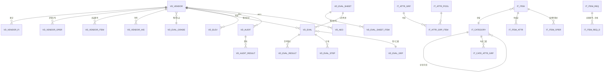

# DB 설계 (Part 4) — VD(협력사·소싱·SRM·평가·감시·규제) · IT(품목·분류·속성)

> 표준(Part1) 적용. 공통컬럼 생략. 표기 🔑PK · ⭐UK · 🔗FK

---

## 1. VD_ 협력사 마스터

### VD_VENDOR (협력사)
| 컬럼 | 타입 | 설명 |
|------|------|------|
| ID 🔑 | NUMBER | 대리키 |
| VD_CD ⭐ | VARCHAR2(18) | 협력사코드 (UK: COMP_CD+VD_CD) |
| ERP_VD_CD | VARCHAR2(18) | ERP(SAP) 협력사코드 |
| VD_NM | VARCHAR2(200) | 협력사명 |
| VD_NM_EN | VARCHAR2(200) | 영문명 |
| BIZ_NO | VARCHAR2(20) | 사업자번호 |
| CORP_NO | VARCHAR2(20) | 법인번호 |
| CEO_NM | VARCHAR2(100) | 대표자 |
| VD_TYP | VARCHAR2(18) | 협력사유형(제조/유통/용역 등) |
| BIZ_COND / BIZ_ITEM | VARCHAR2(200) | 업태/종목 |
| ADDR / TEL / FAX / EMAIL | … | 주소/연락처 |
| GRADE_CD 🔗 | VARCHAR2(18) | 평가등급 → VD_EVAL_GRADE |
| VD_STS | VARCHAR2(18) | 거래상태(거래중/중지/해제) |
| REG_STS | VARCHAR2(18) | 등록진행상태(↓) |
| APRV_ID 🔗 | NUMBER | 등록/수정 결재 |
| IF_STATUS | CHAR(1) | SAP 동기화 상태 |

**REG_STS**: `REQ`신청→`APRV_ING`결재중→`ACTIVE`등록완료 · `REJECT`반려→신청 · `MOD_ING`수정중 · `STOP`중지

### VD_VENDOR_HIS (협력사 이력)
- 변경판수별 스냅샷 (`VD_CD`🔗, `HIS_SEQ`, 변경전 주요필드, `CHG_TYP`, `APRV_ID`)

### VD_VENDOR_FI (협력사 재무정보)
- `VD_CD`🔗⭐, `FI_YEAR`⭐(결산년도), `SALES_AMT`(매출액), `CAPITAL`(자본금), `DEBT_RATE`(부채비율), `CREDIT_GRADE`(신용등급), `EMP_CNT`(종업원수), `ATTACH_GRP_ID`(재무제표)

### VD_VENDOR_OPER (협력사 운영조직 매핑)
- `VD_CD`🔗+`OPER_ORG_CD`🔗⭐, `PAY_COND`(결제조건), `USE_YN`

### VD_VENDOR_ITEM (공급 가능 품목) — 선택
- `VD_CD`🔗+`ITEM_CD`🔗⭐ — 협력사별 취급/공급가능 품목

---

## 2. VD_ 협력사 평가 (esourcing.eval + srm.eval: 시트→실행→집계→완료)

### VD_EVAL_SHEET / VD_EVAL_SHEET_ITEM (평가시트 템플릿 — 의존심사 ingp)
- VD_EVAL_SHEET: `SHEET_CD`⭐, `SHEET_NM`, `EVAL_TYP`(등록/정기/수시), `USE_YN`
- VD_EVAL_SHEET_ITEM: `SHEET_CD`🔗+`ITEM_SEQ`⭐, `EVAL_ITEM_NM`, `EVAL_CLS`(정량/정성), `WEIGHT`(배점), `INPUT_TYP`(점수/선택/텍스트), `UP_ITEM_SEQ`(평가시트 의존성 ▲)

### VD_EVAL (평가 실행 헤더)
| 컬럼 | 타입 | 설명 |
|------|------|------|
| ID 🔑 | NUMBER | 대리키 |
| EVAL_NO ⭐ | VARCHAR2(30) | 평가번호 |
| EVAL_TYP | VARCHAR2(18) | 등록평가/정기재평가/수시 |
| SHEET_CD 🔗 | VARCHAR2(18) | 평가시트 |
| VD_CD 🔗 | VARCHAR2(18) | 대상 협력사 |
| EVAL_GRP_CD 🔗 | VARCHAR2(18) | 평가그룹(egsg) |
| EVAL_PERIOD | VARCHAR2(20) | 평가대상기간 |
| TOT_SCORE | NUMBER(10,5) | 종합점수(집계) |
| GRADE_CD 🔗 | VARCHAR2(18) | 산출등급(efes) |
| STS | VARCHAR2(18) | 진행상태(↓) |

**STS(평가 생명주기)**: `READY`준비→`EXECUTE`실행(측정입력)→`SUMMARY`집계→`CMPL`완료 · `REJECT`반려(보완)→실행

### VD_EVAL_RESULT (평가 항목별 점수)
- `EVAL_ID`🔗, `SHEET_ITEM_SEQ`🔗⭐, `EVALUATOR_ID`(평가자), `SCORE`, `WEIGHT`, `WEIGHTED_SCORE`, `OPINION`(정성의견)

### VD_EVAL_STEP (평가 단계/승인 진행)
- `EVAL_ID`🔗, `STEP_NO`⭐, `STEP_NM`, `STEP_USR_ID`, `STEP_STS`, `STEP_DT`

### VD_EVAL_GRADE (평가등급 efes) / VD_EVAL_GRP (평가그룹 egsg)
- VD_EVAL_GRADE: `GRADE_CD`⭐, `GRADE_NM`(A/B/C…), `MIN_SCORE`, `MAX_SCORE`, `ACTION`(우대/제재 정책)
- VD_EVAL_GRP: `EVAL_GRP_CD`⭐, `EVAL_GRP_NM`, `SOURCING_GRP_CD`(소싱그룹 매핑)

### VD_EVAL_MATRIX (평가매트릭스 hfm)
- `MATRIX_CD`⭐, `X_AXIS`(예: 평가등급), `Y_AXIS`(예: 구매금액대), `CELL_VAL`(관리정책/등급), 협력사 포지셔닝 산출

### VD_ELEV (협력사 육성 elev)
- `ELEV_NO`⭐, `VD_CD`🔗, `PGM_TYP`(육성/차별화 DIFF), `PGM_NM`, `START_YMD/END_YMD`, `TARGET`(목표), `RESULT`(성과), `STS`

---

## 3. VD_ 협력사 감시·리스크 (audit/auditnew · aeo · regal)

### VD_AUDIT (협력사 감시 헤더) / VD_AUDIT_RESULT (감시 결과)
| 컬럼(VD_AUDIT) | 타입 | 설명 |
|------|------|------|
| AUDIT_NO ⭐ | VARCHAR2(30) | 감시번호 |
| VD_CD 🔗 | VARCHAR2(18) | 협력사 |
| AUDIT_TYP | VARCHAR2(18) | 감시유형(정기/특별) |
| AUDIT_YMD | DATE | 감시일 |
| AUDITOR_ID | VARCHAR2(18) | 감시자 |
| RESULT_GRADE | VARCHAR2(18) | 종합 결과등급 |
| NOTI_YN | CHAR(1) | 알림발송(메일/SMS) ▲ |
| ATTACH_GRP_ID | … | 첨부(암호화) ▲ |
| STS | VARCHAR2(18) | 상태 |
- VD_AUDIT_RESULT: `AUDIT_ID`🔗, `ITEM_SEQ`⭐, `AUDIT_ITEM_NM`, `RESULT`, `SCORE`, `FINDING`(지적사항), `ACTION_REQ`(개선요청)

### VD_AEO (AEO 안전관리 평가)
- `AEO_NO`⭐, `VD_CD`🔗, `AEO_GRADE`(safe/high/low 안전성), `EVAL_YMD`, `VALID_ED`, 항목별 결과(`VD_AEO_ITEM` 상세), `STS`

### VD_REGAL (규제/법령 정보)
| 컬럼 | 타입 | 설명 |
|------|------|------|
| REGAL_NO ⭐ | VARCHAR2(30) | 법령/규제 번호 |
| REGAL_NM | VARCHAR2(300) | 법령명 |
| REGAL_TYP | VARCHAR2(18) | 구분(법/시행령/고시 등) |
| PLAN_YMD | DATE | 계획(입법예고)일 |
| NOTIFY_YMD | DATE | 공시일 |
| ENFORCE_YMD | DATE | 시행일 |
| TARGET_DESC | VARCHAR2(2000) | 적용대상/내용 |
| ALARM_YN | CHAR(1) | 준수 알림설정 |
| ALARM_BEFORE_DAY | NUMBER | 시행 N일전 알림 |
| STS | VARCHAR2(18) | 상태 |

---

## 4. IT_ 품목·분류·속성

### IT_CATEGORY (품목분류 — 다층)
| 컬럼 | 타입 | 설명 |
|------|------|------|
| CATE_CD ⭐ | VARCHAR2(18) | 분류코드 |
| CATE_NM | VARCHAR2(200) | 분류명 |
| UP_CATE_CD 🔗 | VARCHAR2(18) | 상위분류 |
| CATE_LVL | NUMBER | 분류 레벨(대/중/소/세) |
| SORT_NO | NUMBER | 정렬 |
| LEAF_YN | CHAR(1) | 최하위 여부 |

### IT_ATTR_POOL / IT_ATTR_GRP / IT_ATTR_GRP_ITEM / IT_ATTR_CODE (속성)
- IT_ATTR_POOL(속성풀): `ATTR_CD`⭐, `ATTR_NM`, `DATA_TYP`(문자/숫자/코드/일자), `UNIT`
- IT_ATTR_GRP(속성그룹): `ATTR_GRP_CD`⭐, `ATTR_GRP_NM`
- IT_ATTR_GRP_ITEM(그룹-속성 매핑): `ATTR_GRP_CD`🔗+`ATTR_CD`🔗⭐, `REQ_YN`(필수), `SORT_NO`
- IT_CATE_ATTR_GRP(분류-속성그룹 매핑): `CATE_CD`🔗+`ATTR_GRP_CD`🔗⭐
- IT_ATTR_CODE(속성 코드값): `ATTR_CD`🔗+`ATTR_VAL_CD`⭐, `ATTR_VAL_NM` (열거형 속성)

### IT_ITEM (품목마스터)
| 컬럼 | 타입 | 설명 |
|------|------|------|
| ID 🔑 | NUMBER | 대리키 |
| ITEM_CD ⭐ | VARCHAR2(18) | 품목코드 (UK: COMP_CD+ITEM_CD) |
| ERP_ITEM_CD | VARCHAR2(18) | ERP(SAP) 자재코드 |
| ITEM_NM | VARCHAR2(300) | 품목명 |
| ITEM_NM_EN | VARCHAR2(300) | 영문명 |
| SPEC | VARCHAR2(500) | 규격 |
| CATE_CD 🔗 | VARCHAR2(18) | 분류 |
| UNIT_CD | VARCHAR2(18) | 기본단위 |
| ITEM_TYP | VARCHAR2(18) | 품목유형(원자재/부자재/상품/용역) |
| TAX_TYP | VARCHAR2(18) | 과세유형 |
| IMG_ATTACH_GRP_ID | NUMBER | 이미지 |
| ITEM_STS | VARCHAR2(18) | 상태(신규→승인→활성→중지) |

### IT_ITEM_ATTR (품목 속성값)
- `ITEM_CD`🔗+`ATTR_CD`🔗⭐, `ATTR_VAL`(값), `ATTR_VAL_CD`(코드형 값)

### IT_ITEM_OPER (품목 운영조직/플랜트 정보)
- `ITEM_CD`🔗+`OPER_ORG_CD`🔗⭐, `PLT_CD`, `MEINS`(SAP기본단위), `UMREZ/UMREN`(단위환산), `SAFE_STOCK`(안전재고), `USE_YN`

### IT_ITEM_REQ / IT_ITEM_REQ_D (품목요청·심사)
- IT_ITEM_REQ: `REQ_NO`⭐, `REQ_TYP`(신규/유사), `REQ_USR_ID`, `REQ_DEPT_CD`, `STS`(신청→심사→승인→등록), `APRV_ID`🔗
- IT_ITEM_REQ_D: `REQ_ID`🔗+`LINE_NO`⭐, `ITEM_NM`, `SPEC`, `CATE_CD`, `UNIT_CD`, `SIMILAR_ITEM_CD`(유사품목), `REVIEW_RESULT`(심사결과), `NEW_ITEM_CD`(승인시 채번된 코드)

---

## 5. ERD 관계 (협력사·품목)

---

## 다음 (Part 5 — 마지막)
- QL(품질) · AP(전자결재) · ED(전자계약/서명) · IF(SAP/INDIGO 인터페이스) 컬럼 상세
- 이후: 전체 물리 DDL 스크립트(`db/ddl/`) 생성 단계
